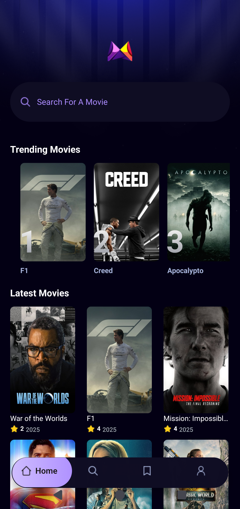
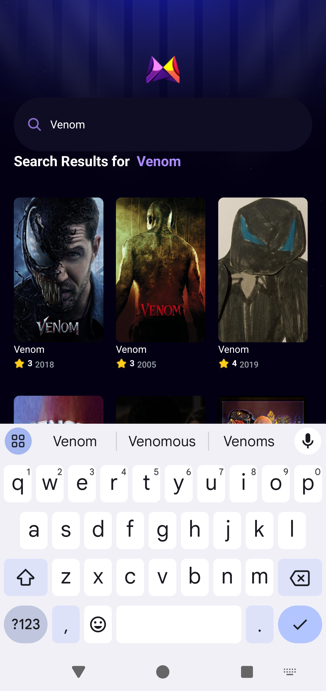
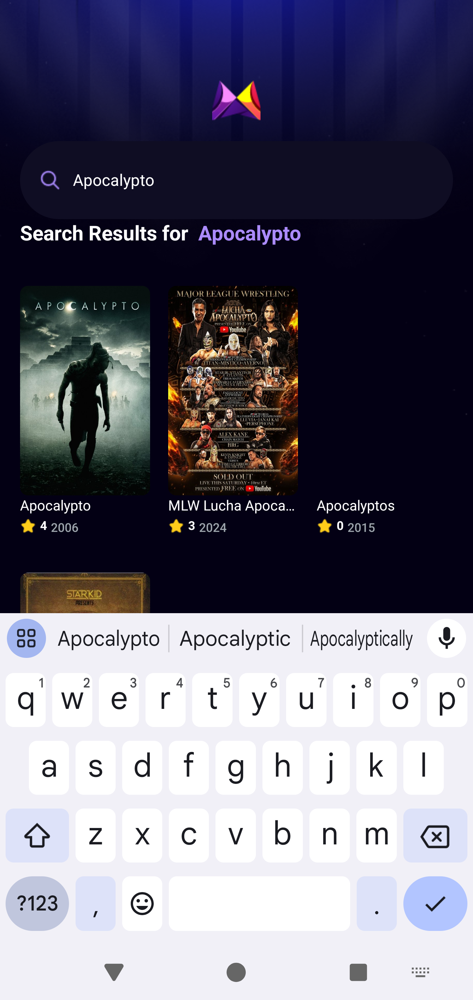
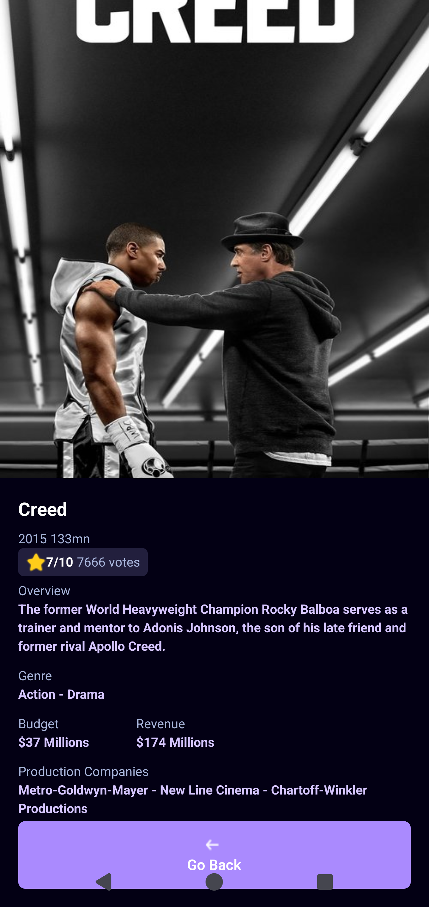
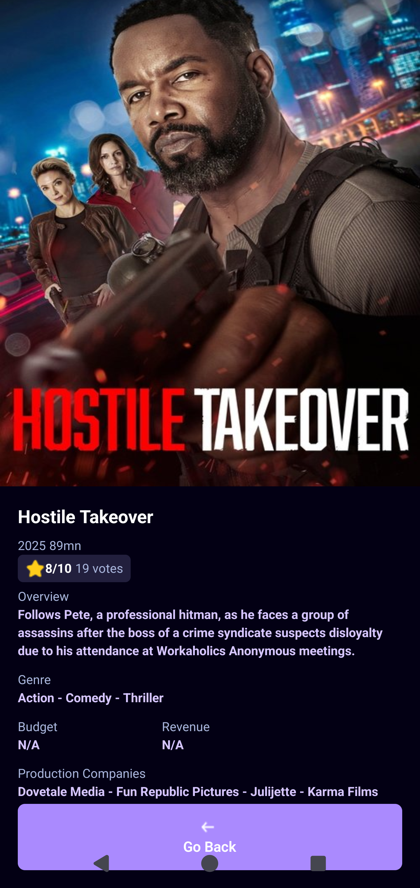

# 🎬 MovieApp - React Native Cinema Discovery

Languages: 🇺🇸 [English](#english) | 🇫🇷 [Français](#français)

## English

A modern movie discovery mobile application built with React Native and Expo, featuring comprehensive movie listings, detailed movie information pages, and advanced search functionality. Powered by The Movie Database (TMDB) API with beautiful UI design using NativeWind (Tailwind CSS for React Native).

## 📋 Table of Contents
- [📱 App Screenshots](#-app-screenshots)
- [🌟 Features](#-features)
- [🏗️ Project Structure](#️-project-structure)
- [🛠️ Technologies Used](#️-technologies-used)
- [⚙️ Installation](#️-installation)
- [🚀 Usage](#-usage)
- [📡 API Integration](#-api-integration)
- [🎨 Design Features](#-design-features)
- [🧪 Testing](#-testing)
- [📝 Contributing](#-contributing)
- [📄 License](#-license)
- [👨‍💻 Author](#-author)

## 📱 App Screenshots

### 🏠 Home Screen Views
<div align="center">

| Trending Movies | Popular Movies |
|:--------------:|:----------------:|
|  |  |

</div>

### 🔍 Search Functionality  
<div align="center">

| Search Results 1 | Search Results 2 |
|:----------------:|:--------------:|
|  |  |

</div>

### 🎬 Movie Details Pages
<div align="center">

| Creed III | Formula 1: Drive to Survive | Hostile Takeover |
|:---------:|:---------------------------:|:----------------:|
|  |  |  |

</div>


## 🌟 Features

✅ **Movie Discovery** - Browse through popular movies with infinite scroll  
✅ **Advanced Search** - Find movies by title with real-time search functionality  
✅ **Movie Details** - Comprehensive movie information including:
- Movie poster and backdrop images
- Release date, runtime, and ratings
- Budget and revenue information  
- Production companies and genres
- Movie overview and description
- Vote average and vote count

✅ **Interactive Navigation** - Smooth navigation between screens with gesture support  
✅ **Responsive Design** - Optimized for different screen sizes  
✅ **Modern UI** - Beautiful interface using NativeWind (Tailwind CSS)  
✅ **Cross-Platform** - Works on both iOS and Android  
✅ **Real-time Data** - Live data from TMDB API  
✅ **Error Handling** - Graceful handling of API errors and loading states

## 🏗️ Project Structure

```
MovieApp/
├── 📁 app/                    # App screens and routing
│   ├── _layout.tsx           # Root layout configuration
│   ├── globals.css           # Global styles
│   ├── (tabs)/              # Tab-based navigation
│   │   ├── _layout.tsx      # Tab layout
│   │   ├── index.tsx        # Home screen (Popular movies)
│   │   ├── search.tsx       # Search screen
│   │   ├── saved.tsx        # Saved movies screen
│   │   └── profile.tsx      # Profile screen
│   └── movies/              # Movie-related screens
│       └── [id].tsx         # Dynamic movie details page
├── 📁 assets/              # Static assets
│   ├── fonts/              # Custom fonts
│   │   └── SpaceMono-Regular.ttf # SpaceMono font
│   ├── icons/              # App icons
│   │   ├── arrow.png       # Arrow icon
│   │   ├── home.png        # Home icon
│   │   ├── logo.png        # App logo
│   │   ├── person.png      # Person icon
│   │   ├── play.png        # Play icon
│   │   ├── save.png        # Save icon
│   │   ├── search.png      # Search icon
│   │   └── star.png        # Star icon
│   └── images/             # App images
│       ├── bg.png          # Background image
│       ├── highlight.png   # Highlight image
│       ├── icon.png        # App icon
│       ├── logo.png        # Logo image
│       └── rankingGradient.png # Ranking gradient
├── 📁 components/            # Reusable UI components
│   ├── MovieCard.tsx        # Movie card component
│   ├── SearchBar.tsx        # Search input component
│   ├── TabIcon.tsx          # Tab icon component
│   └── TrendingCard.tsx     # Trending movies card component
├── 📁 constants/            # App constants and themes
│   ├── icons.ts             # Icon definitions
│   └── images.ts            # Image constants and base URLs
├── 📁 interfaces/           # TypeScript interfaces
│   └── interfaces.d.ts      # Type definitions
├── 📁 Screen/              # App screenshots and media
│   ├── Home.png            # Home screen screenshot
│   ├── Home2.png           # Home screen variant
│   ├── MovieDetailsCreed.png # Movie details screenshot
│   ├── MovieDetailsF1.png  # Movie details screenshot
│   ├── MovieDetailsHostileTakeOver.png # Movie details screenshot
│   ├── Research.png        # Search screen screenshot
│   ├── Research2.png       # Search results screenshot
│   └── Screenshot_1756180559.png # Additional screenshot
├── 📁 services/             # API and data services
│   ├── api.ts               # TMDB API integration
│   ├── appwrite.ts          # Appwrite configuration
│   └── useFetch.ts          # Custom fetch hook
├── 📁 types/               # Additional type definitions
│   └── images.d.ts         # Image type definitions
├── .env.example            # Environment variables template
├── .gitignore              # Git ignore file
├── app.json               # Expo app configuration
├── babel.config.js        # Babel configuration
├── eslint.config.js       # ESLint configuration
├── expo-env.d.ts          # Expo environment types
├── metro.config.js        # Metro bundler configuration
├── nativewind-env.d.ts    # NativeWind environment types
├── package.json           # Project dependencies
├── package-lock.json      # Lock file for dependencies
├── README.md              # Project documentation
├── tailwind.config.js     # Tailwind CSS configuration
└── tsconfig.json          # TypeScript configuration
```

## 🛠️ Technologies Used

### 📱 Mobile Framework
- **React Native** 0.81.4 - Core mobile development framework
- **Expo** ^54.0.9 - Development platform and toolchain  
- **Expo Router** ~5.1.5 - File-based routing system

### 🎨 UI/UX Libraries
- **NativeWind** ^4.1.23 - Tailwind CSS for React Native
- **Tailwind CSS** ^3.4.17 - Utility-first CSS framework
- **React Native Reanimated** ~3.17.4 - Advanced animations
- **React Native Gesture Handler** ~2.24.0 - Touch gesture handling
- **Expo Image** ~2.4.0 - Optimized image rendering
- **Expo Blur** ~14.1.5 - Background blur effects

### 🌐 API & Data Management
- **TMDB API** - The Movie Database REST API integration
- **React Native Appwrite** ^0.11.0 - Backend services
- **Custom Hooks** - useFetch for data fetching and state management

### 🎭 UI Components & Styling
- **React Native Safe Area Context** ^5.4.0 - Safe area handling
- **Expo Symbols** ~0.4.5 - System icons
- **React Navigation** ^7.1.6 - Navigation library
- **Expo Status Bar** ~2.2.3 - Status bar styling

### 🔧 Development Tools
- **TypeScript** ~5.8.3 - Type safety
- **ESLint** ^9.25.0 - Code linting
- **Prettier** - Code formatting
- **Autoprefixer** ^10.4.21 - CSS vendor prefixes

## ⚙️ Installation

### Prerequisites
- Node.js (version 18 or higher)
- npm or yarn package manager
- Expo CLI (`npm install -g @expo/cli`)
- iOS Simulator (for iOS development) or Android Studio (for Android development)
- TMDB API Key (free registration at [themoviedb.org](https://www.themoviedb.org/))

### 🔧 Installation Steps

1. **Clone the repository**
   ```bash
   git clone https://github.com/MrSalifDiallo/MovieAppReactNative.git
   cd MovieApp
   ```

2. **Install dependencies**
   
   **2.1 If you're using npm as your package manager**  
   ```bash
   npm install
   ```
   **2.2 If you're using pnpm as your package manager** 
      #### Sous PowerShell :
      ```powershell
      "node-linker=hoisted" | Out-File -Encoding ascii .npmrc
      pnpm install
      ```
      ### Sous CMD
      ```bash
      echo node-linker=hoisted > .npmrc
      pnpm install
      ```

3. **Set up environment variables**
   ```bash
   cp .env.example .env
   ```
   
   Edit `.env` file and add your TMDB API key:
   ```env
   EXPO_PUBLIC_MOVIE_API=your_tmdb_api_key_here
   EXPO_PUBLIC_APPWRITE_PROJECT_NAME=your_APPWRITE_PROJECTNAME_here #Optional
   EXPO_PUBLIC_APPWRITE_ENDPOINT="https://nyc.cloud.appwrite.io/v1"  #Endpoint of AppWrite
   EXPO_PUBLIC_APPWRITE_DATABASE_ID=your_APPWRITE_DATABASE_ID_here
   EXPO_PUBLIC_APPWRITE_COLLECTION_ID=your_APPWRITE_COLLECTION_ID_here
   ```

4. **Start the development server**
   ```bash
   npx expo start
   ```

5. **Run on your preferred platform**
   - Press `i` for iOS simulator
   - Press `a` for Android emulator  
   - Scan QR code with Expo Go app on your device

## 🚀 Usage

### 🏠 Home Screen (Popular Movies)
- Browse through a curated list of popular movies
- Scroll through movie posters with smooth animations
- Tap on any movie to view detailed information
- Pull to refresh for latest popular movies

### 🔍 Search Screen  
- Search for movies by title using the search bar
- Real-time search results as you type
- View search results in a clean grid layout
- Tap on search results to view movie details

### 🎬 Movie Details Page
- View high-resolution movie posters and backdrops
- Access comprehensive movie information:
  - Release date, runtime, and user ratings
  - Budget and revenue (in millions)
  - Production companies and genres
  - Detailed movie overview
- Navigate back with the custom back button
- Smooth transitions and animations

## 📡 API Integration

The app integrates with **The Movie Database (TMDB) API** for real-time movie data:

### 🔄 Data Fetching Features
- **Popular Movies**: `/discover/movie?sort_by=popularity.desc`
- **Movie Search**: `/search/movie?query={searchTerm}`  
- **Movie Details**: `/movie/{movieId}`
- **Image URLs**: High-quality movie posters and backdrops
- **Error Handling**: Graceful handling of API failures
- **Loading States**: Smooth loading indicators during data fetch

### API Configuration
```typescript
const TMDB_CONFIG = {
    BASE_URL: 'https://api.themoviedb.org/3',
    API_KEY: process.env.EXPO_PUBLIC_MOVIE_API,
    headers: {
        accept: 'application/json',
        Authorization: `Bearer ${process.env.EXPO_PUBLIC_MOVIE_API}`
    }
}
```

## 🎨 Design Features

- **Modern UI**: Clean and intuitive interface design
- **NativeWind Integration**: Tailwind CSS utilities for React Native
- **Responsive Layout**: Adapts to different screen sizes
- **Smooth Animations**: Fluid transitions between screens
- **Custom Components**: Reusable UI components throughout the app
- **Typography**: Consistent font weights and sizes
- **Color Scheme**: Professional dark theme with accent colors

## 🧪 Testing

To run the app in development mode:

```bash
# Start Expo development server
npx expo start # npm
pnpm start # pnpm

# Run on iOS simulator
npx expo start --ios # npm 
pnpm start --ios # pnpm

# Run on Android emulator  
npx expo start --android # npm
pnpm start --android # pnpm

# Run on web browser
npx expo start --web # npm
pnpm start --web # pnpm

# Run on a distant mobile phone with exposition of an optional port[portNumber]
# With Ngrok
npx expo start --tunnel # npm
pnpm start --tunnel # pnpm


#Take an optional Port 
npx expo start --tunnel -- --port=portNumber # npm
pnpm start --tunnel -- --port=portNumber # pnpm
```

## 📝 Contributing

1. Fork the repository
2. Create your feature branch (`git checkout -b feature/AmazingFeature`)
3. Commit your changes (`git commit -m 'Add some AmazingFeature'`)
4. Push to the branch (`git push origin feature/AmazingFeature`)
5. Open a Pull Request

## 📄 License

This project is licensed under the MIT License - see the LICENSE file for details.

## 👨‍💻 Author

**Salif Diallo**
- GitHub: [@MrSalifDiallo](https://github.com/MrSalifDiallo)
- LinkedIn: [Salif Diallo](https://www.linkedin.com/in/salif-diallo-152650313/)
- Mail: [salifdiallo@esp.sn](mailto:salifdiallo@esp.sn)

---

## Français

Une application mobile moderne de découverte de films construite avec React Native et Expo, proposant des listes complètes de films, des pages d'informations détaillées et une fonctionnalité de recherche avancée. Alimentée par l'API The Movie Database (TMDB) avec un design UI magnifique utilisant NativeWind (Tailwind CSS pour React Native).

## 📋 Table des Matières
- [📱 Captures d'écran](#-captures-décran)
- [🌟 Fonctionnalités](#-fonctionnalités)
- [🏗️ Structure du projet](#️-structure-du-projet)
- [🛠️ Technologies utilisées](#️-technologies-utilisées)
- [⚙️ Installation](#️-installation-1)
- [🚀 Utilisation](#-utilisation)
- [📡 Intégration API](#-intégration-api)
- [🎨 Fonctionnalités de design](#-fonctionnalités-de-design)
- [🧪 Tests](#-tests)
- [📝 Contribution](#-contribution)
- [📄 Licence](#-licence)
- [👨‍💻 Auteur](#-auteur)

## 📱 Captures d'écran

### 🏠 Vues Écran d'accueil
<div align="center">

| Films Populaires | Section Tendances |
|:----------------:|:-----------------:|
|  |  |

</div>

### 🔍 Fonctionnalité de recherche
<div align="center">

| Interface de recherche | Résultats de recherche |
|:----------------------:|:----------------------:|
|  |  |

</div>

### 🎬 Pages Détails du film
<div align="center">

| Creed III | Formula 1: Drive to Survive | Hostile Takeover |
|:---------:|:---------------------------:|:----------------:|
|  |  |  |

</div>


## 🌟 Fonctionnalités

✅ **Découverte de films** - Parcourir les films populaires avec défilement infini  
✅ **Recherche avancée** - Trouver des films par titre avec fonctionnalité de recherche en temps réel  
✅ **Détails du film** - Informations complètes sur le film incluant :
- Affiches et images de fond du film
- Date de sortie, durée et notes
- Informations sur le budget et les revenus
- Sociétés de production et genres
- Aperçu et description du film
- Note moyenne et nombre de votes

✅ **Navigation interactive** - Navigation fluide entre les écrans avec support gestuel  
✅ **Design réactif** - Optimisé pour différentes tailles d'écran  
✅ **Interface moderne** - Belle interface utilisant NativeWind (Tailwind CSS)  
✅ **Multi-plateforme** - Fonctionne sur iOS et Android  
✅ **Données en temps réel** - Données en direct depuis l'API TMDB  
✅ **Gestion d'erreurs** - Gestion élégante des erreurs API et des états de chargement

## 🏗️ Structure du projet

```
MovieApp/
├── 📁 app/                    # Écrans et routage de l'application
│   ├── _layout.tsx           # Configuration de la mise en page racine
│   ├── globals.css           # Styles globaux
│   ├── (tabs)/              # Navigation par onglets
│   │   ├── _layout.tsx      # Mise en page des onglets
│   │   ├── index.tsx        # Écran d'accueil (Films populaires)
│   │   ├── search.tsx       # Écran de recherche
│   │   ├── saved.tsx        # Écran des films sauvegardés
│   │   └── profile.tsx      # Écran de profil
│   └── movies/              # Écrans liés aux films
│       └── [id].tsx         # Page dynamique des détails du film
├── 📁 assets/              # Ressources statiques
│   ├── fonts/              # Polices personnalisées
│   │   └── SpaceMono-Regular.ttf # Police SpaceMono
│   ├── icons/              # Icônes de l'application
│   │   ├── arrow.png       # Icône flèche
│   │   ├── home.png        # Icône accueil
│   │   ├── logo.png        # Logo de l'application
│   │   ├── person.png      # Icône personne
│   │   ├── play.png        # Icône lecture
│   │   ├── save.png        # Icône sauvegarder
│   │   ├── search.png      # Icône recherche
│   │   └── star.png        # Icône étoile
│   └── images/             # Images de l'application
│       ├── bg.png          # Image de fond
│       ├── highlight.png   # Image de surbrillance
│       ├── icon.png        # Icône de l'application
│       ├── logo.png        # Image du logo
│       └── rankingGradient.png # Dégradé de classement
├── 📁 components/            # Composants UI réutilisables
│   ├── MovieCard.tsx        # Composant carte de film
│   ├── SearchBar.tsx        # Composant champ de recherche
│   ├── TabIcon.tsx          # Composant icône d'onglet
│   └── TrendingCard.tsx     # Composant carte films tendance
├── 📁 constants/            # Constantes et thèmes de l'application
│   ├── icons.ts             # Définitions des icônes
│   └── images.ts            # Constantes d'images et URLs de base
├── 📁 interfaces/           # Interfaces TypeScript
│   └── interfaces.d.ts      # Définitions de types
├── 📁 Screen/              # Captures d'écran et médias de l'application
│   ├── Home.png            # Capture d'écran d'accueil
│   ├── Home2.png           # Variante écran d'accueil
│   ├── MovieDetailsCreed.png # Capture détails de film
│   ├── MovieDetailsF1.png  # Capture détails de film
│   ├── MovieDetailsHostileTakeOver.png # Capture détails de film
│   ├── Research.png        # Capture d'écran de recherche
│   ├── Research2.png       # Capture des résultats de recherche
│   └── Screenshot_1756180559.png # Capture d'écran supplémentaire
├── 📁 services/             # Services API et données
│   ├── api.ts               # Intégration API TMDB
│   ├── appwrite.ts          # Configuration Appwrite
│   └── useFetch.ts          # Hook de récupération personnalisé
├── 📁 types/               # Définitions de types supplémentaires
│   └── images.d.ts         # Définitions de types d'images
├── .env.example            # Modèle de variables d'environnement
├── .gitignore              # Fichier d'exclusion Git
├── app.json               # Configuration de l'application Expo
├── babel.config.js        # Configuration Babel
├── eslint.config.js       # Configuration ESLint
├── expo-env.d.ts          # Types d'environnement Expo
├── metro.config.js        # Configuration Metro bundler
├── nativewind-env.d.ts    # Types d'environnement NativeWind
├── package.json           # Dépendances du projet
├── package-lock.json      # Fichier de verrouillage des dépendances
├── README.md              # Documentation du projet
├── tailwind.config.js     # Configuration Tailwind CSS
└── tsconfig.json          # Configuration TypeScript
```

## 🛠️ Technologies utilisées

### 📱 Framework Mobile
- **React Native** 0.81.4 - Framework de développement mobile principal
- **Expo** ~54.0.9 - Plateforme de développement et chaîne d'outils
- **Expo Router** ~5.1.5 - Système de routage basé sur les fichiers

### 🎨 Bibliothèques UI/UX
- **NativeWind** ^4.1.23 - Tailwind CSS pour React Native
- **Tailwind CSS** ^3.4.17 - Framework CSS utilitaire
- **React Native Reanimated** ~3.17.4 - Animations avancées
- **React Native Gesture Handler** ~2.24.0 - Gestion des gestes tactiles
- **Expo Image** ~2.4.0 - Rendu d'images optimisé
- **Expo Blur** ~14.1.5 - Effets de flou d'arrière-plan

### 🌐 API et gestion des données
- **API TMDB** - Intégration API REST The Movie Database
- **React Native Appwrite** ^0.11.0 - Services backend
- **Hooks personnalisés** - useFetch pour la récupération de données et gestion d'état

### 🎭 Composants UI et style
- **React Native Safe Area Context** ^5.4.0 - Gestion de la zone sûre
- **Expo Symbols** ~0.4.5 - Icônes système
- **React Navigation** ^7.1.6 - Bibliothèque de navigation
- **Expo Status Bar** ~2.2.3 - Style de la barre d'état

### 🔧 Outils de développement
- **TypeScript** ~5.8.3 - Sécurité des types
- **ESLint** ^9.25.0 - Linting du code
- **Prettier** - Formatage du code
- **Autoprefixer** ^10.4.21 - Préfixes CSS des fournisseurs

## ⚙️ Installation

### Prérequis
- Node.js (version 18 ou supérieure)
- Gestionnaire de paquets npm ou yarn
- Expo CLI (`npm install -g @expo/cli`)
- Simulateur iOS (pour le développement iOS) ou Android Studio (pour le développement Android)
- Clé API TMDB (inscription gratuite sur [themoviedb.org](https://www.themoviedb.org/))

### 🔧 Étapes d'installation

1. **Cloner le dépôt**
   ```bash
   git clone https://github.com/MrSalifDiallo/MovieAppReactNative.git
   cd MovieApp
   ```

2. **Installer les dépendances**

   **2.1 Si vous utilisez npm comme gestionnaire de paquets**  
   ```bash
   npm install
   ```
   **2.2 Si vous utilisez pnpm comme gestionnaire de paquets** 
      #### Sous PowerShell :
      ```powershell
      "node-linker=hoisted" | Out-File -Encoding ascii .npmrc
      pnpm install
      ```
      ### Sous CMD
      ```bash
      echo node-linker=hoisted > .npmrc
      pnpm install
      ```
3. **Configurer les variables d'environnement**
   ```bash
   cp .env.example .env
   ```
   
   Modifier le fichier `.env` et ajouter votre clé API TMDB :
   ```env
   EXPO_PUBLIC_MOVIE_API=votre_cle_api_tmdb_ici
   ```

4. **Démarrer le serveur de développement**
   ```bash
   npx expo start
   ```

5. **Exécuter sur votre plateforme préférée**
   - Appuyez sur `i` pour le simulateur iOS
   - Appuyez sur `a` pour l'émulateur Android
   - Scannez le code QR avec l'application Expo Go sur votre appareil

## 🚀 Utilisation

### 🏠 Écran d'accueil (Films populaires)
- Parcourir une liste organisée de films populaires
- Faire défiler les affiches de films avec des animations fluides
- Appuyer sur n'importe quel film pour voir les informations détaillées
- Tirer pour actualiser les derniers films populaires

### 🔍 Écran de recherche
- Rechercher des films par titre en utilisant la barre de recherche
- Résultats de recherche en temps réel pendant la saisie
- Voir les résultats de recherche dans une mise en page en grille propre
- Appuyer sur les résultats de recherche pour voir les détails du film

### 🎬 Page de détails du film
- Voir les affiches et arrière-plans haute résolution des films
- Accéder aux informations complètes du film :
  - Date de sortie, durée et notes des utilisateurs
  - Budget et revenus (en millions)
  - Sociétés de production et genres
  - Aperçu détaillé du film
- Naviguer en arrière avec le bouton de retour personnalisé
- Transitions et animations fluides

## 📡 Intégration API

L'application s'intègre avec **l'API The Movie Database (TMDB)** pour les données de films en temps réel :

### 🔄 Fonctionnalités de récupération de données
- **Films populaires** : `/discover/movie?sort_by=popularity.desc`
- **Recherche de films** : `/search/movie?query={termeDe Recherche}`
- **Détails du film** : `/movie/{movieId}`
- **URLs d'images** : Affiches et arrière-plans de films haute qualité
- **Gestion d'erreurs** : Gestion élégante des échecs d'API
- **États de chargement** : Indicateurs de chargement fluides pendant la récupération de données

### Configuration API
```typescript
const TMDB_CONFIG = {
    BASE_URL: 'https://api.themoviedb.org/3',
    API_KEY: process.env.EXPO_PUBLIC_MOVIE_API,
    headers: {
        accept: 'application/json',
        Authorization: `Bearer ${process.env.EXPO_PUBLIC_MOVIE_API}`
    }
}
```

## 🎨 Fonctionnalités de design

- **Interface moderne** : Design d'interface propre et intuitif
- **Intégration NativeWind** : Utilitaires Tailwind CSS pour React Native
- **Mise en page réactive** : S'adapte à différentes tailles d'écran
- **Animations fluides** : Transitions fluides entre les écrans
- **Composants personnalisés** : Composants UI réutilisables dans toute l'application
- **Typographie** : Poids et tailles de police cohérents
- **Schéma de couleurs** : Thème sombre professionnel avec couleurs d'accent

## 🧪 Tests

Pour exécuter l'application en mode développement :

```bash
# Démarrer le serveur de développement Expo
npx expo start # npm
pnpm start # pnpm

# Exécuter sur le simulateur iOS
npx expo start --ios # npm
pnpm start --ios # pnpm

# Exécuter sur l'émulateur Android
npx expo start --android # npm
pnpm start --android # pnpm

# Exécuter sur le navigateur web
npx expo start -- #npm
pnpm start -- #pnpm


# Exécuter sur un téléphone distant après exposition de [numéroPort]optionnel
# Avec Ngrok
npx expo start --tunnel # npm
pnpm start --tunnel # pnpm


#Prendre un port 
npx expo start --tunnel -- --port=numéroPort # npm
pnpm start --tunnel -- --port=numéroPort # pnpm
```

## 📝 Contribution

1. Forker le dépôt
2. Créer votre branche de fonctionnalité (`git checkout -b feature/FonctionnaliteIncroyable`)
3. Commiter vos changements (`git commit -m 'Ajouter une fonctionnalité incroyable'`)
4. Pousser vers la branche (`git push origin feature/FonctionnaliteIncroyable`)
5. Ouvrir une Pull Request

## 📄 Licence

Ce projet est sous licence MIT - voir le fichier LICENSE pour plus de détails.

## 👨‍💻 Auteur

**Salif Diallo**
- GitHub: [@MrSalifDiallo](https://github.com/MrSalifDiallo)
- LinkedIn: [Salif Diallo](https://www.linkedin.com/in/salif-diallo-152650313/)
- Mail: [salifdiallo@esp.sn](mailto:salifdiallo@esp.sn)
